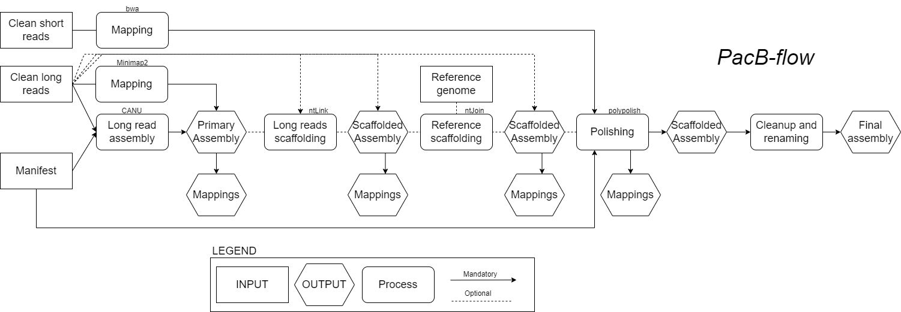

# PacB-flow
PacBio long reads assebly workflow based on Nextflow.    


Summary of the workflow is shown below


## Nexflow pipeline
Nexflow version has to be >22.10.7, please install it following the instructions [here](https://www.nextflow.io/docs/latest/install.html).

## How to run the pipeline
The assembly requires significant memory usage, thus the use of an HPC is recommended. Local machines are not able to handle the high memory peak.    

The pipeline uses the state-of-the-art assembly algorithms, optimized for fungal pathogens with an expected genome size of 40MB. The pipeline runs the following:     
* CANU primary assembly - this first stage assembly trims, corrects and assembles the raw input reads. It is important to know that the algorithm is not deterministic and slight changes are expected between runs. Please reads the documentation [here](https://github.com/AustralianBioCommons/Canu/blob/master/Canu.md#how-does-the-biocommons-optimised-canu-compare-with-canu) for more details. For further optimization on other HPC systems, please consider the BioCommons benchmarking, as described [here](https://github.com/AustralianBioCommons/Canu/blob/master/NCI_optimisation.md).    
* The default run stops at the primary assembly. With the option ```ntlink_run=true```, the pipeline runs the long read scaffolding stage performed by ntLink.    
* By adding the path to a reference genome with ```ntjoin_ref=/path/to/my/genome```, the pipeline runs a reference scaffolding stage with ntJoin, after the long reads scaffolding.     
* It is important to note that long reads scaffolding is the first stage of scaffolding, followied by reference scaffolding.    
* The following parameters, allow the execution of different flavours of teh assembly pipeline:       
	1. Default parameters - primary assembly only          
	2. ```ntlink_run=true``` - primary assembly and long reads scaffodling      
	3. ```ntjoin_ref=/path/to/my/genome``` - primary assembly and reference scaffolding     
	4. ```ntlink_run=true``` and ```ntjoin_ref=/path/to/my/genome``` - primary assembly, long reads and reference scaffoding       

## Manifest file format
The manifest contains the pairing of short and long reads to be used for the assembly. An example of the manifest can be found in ```testrun_manifest/samples.csv```.    
```
sampleId,lr_reads,sr_read1,sr_read2
name,/path/to/longreads,/path/to/pair1,/path/to/pair2
```
## 1. Default parameters
Pawsey - Setonix run setup
```
nextflow run ./main.nf \
        -resume \
        -profile pawsey_setonix,singularity \
        --manifest samples.tsv
```

## 2. Scaffolding with long reads
The pipeline uses the primary assembly and the raw reads to scaffold the genome, with complete pipeline options and ```ntLink_rounds``` + gap filling. The resulting genome, if a reference genome is provided, is passed to ntJoin (see info below). This is an example to run the ntLink step only (by default ntLink is not run):
```
nextflow run ./main.nf -resume \
        -profile pawsey_setonix,singularity \
        --manifest samples.tsv \
        --ntlink_run true
```

## 3. Scaffolding with reference genome
The pipeline will use a reference genome if provides and will use it for scaffolding with ntJoin pipeline. If not provided, it will skip this step. Please refer to the parameters for PacB-flow with scaffolding. Refer to the [ntJoin](https://github.com/bcgsc/ntJoin) code for more details.                 
ntJoin can get multiple genomes as an input; for simplicity, we only use one at the time here.    

Example script
```
nextflow run ./main.nf -resume \
        -profile pawsey_setonix,singularity \
        --manifest samples.tsv \
        --ntjoin_ref '/path/to/refgenome/PacB-flow/GCA_900231935.2_ERZ478497_genomic.fna' \ 
	--ntjoin_ref_weights '2' \ #string, weight for refernce genome
        --ntjoin_w 500 \ # window size
        --ntjoin_k 24 \ # kmer size
        --ntjoin_no_cut 'True' # do not cut input genome
```

## 4. Scaffolding with long reads and reference genome
```
nextflow run ./main.nf -resume \
        -profile pawsey_setonix,singularity \
        --manifest samples.tsv \
        --ntlink_run true \
        --ntjoin_ref '/path/to/refgenome//PacB-flow/GCA_900231935.2_ERZ478497_genomic.fna' \
        --ntjoin_ref_weights '2' \
        --ntjoin_w 500 \
        --ntjoin_k 24 \
        --ntjoin_no_cut 'True'
```

## Output
```
results/processing/canu/*                #primary assemby and report
results/processing/pbmm/*                #primary assembly long reads alignment
results/processing/ntlink/*              #scaffolded genome - long reads (optional) 
results/processing/ntjoin/*              #scaffolded genome - ref (optional) 
results/processing/abyss/all_stats.tsv   #all samples assembly stats
```
