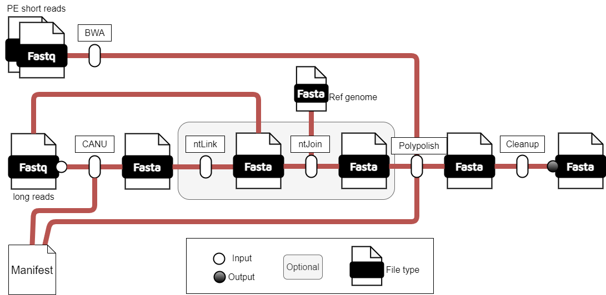

# PacB-flow

The PacBio long reads assembly workflow, authored by Dr. Kristina K. Gagalova, is developed using the Nextflow framework, suitable for HPC environmentgs. 
This workflow is designed to assembly genomes with long-read and polish with short reads. 
The project is developed under the Analytics for the Australian Grains Industry (AAGI) and is carried out for the Centre for Crop and Disease Management (CCDM). 
The workflow is part of broader efforts to enhance genomic research in crop disease management and improve the understanding of pathogen resistance in plants.


*PacB-flow pipeline.*

If you encounter any bugs or have suggestions for new features, please open an issue or feel free to contact the author directly for assistance.

## Nexflow pipeline framework
The Nexflow version must be >22.10.7. Please install it following the instructions [here](https://www.nextflow.io/docs/latest/install.html).

## How to run the pipeline
The assembly requires significant memory usage, with a peak memory of >100 Gb. Most local machines are not able to handle the high memory peak so an HPC or supercomputer is recommended.    

The pipeline uses state-of-the-art assembly algorithms optimized for fungal pathogens with an expected genome size of ~40MB.    

The pipeline runs the following:     
*  primary assembly - this first stage of assembly trims, corrects and assembles the raw input reads. It is important to know that the algorithm is not deterministic, and slight changes are expected between runs. Please read the documentation [here](https://github.com/AustralianBioCommons/Canu/blob/master/Canu.md#how-does-the-biocommons-optimised-canu-compare-with-canu) for more details. For further optimization on other HPC systems, please consider the BioCommons benchmarking, as described [here](https://github.com/AustralianBioCommons/Canu/blob/master/NCI_optimisation.md).    
* The default run stops at the primary assembly. With the option ```ntlink_run true```, the pipeline runs the long read scaffolding stage performed by .    
* By adding the path to a reference genome with ```ntjoin_ref /path/to/my/genome```, the pipeline runs a reference scaffolding stage with  after the long reads scaffolding.     
* Long reading scaffolding is the first stage, followed by reference scaffolding.    

The following parameters allow the execution of different flavours of the assembly pipeline:       
	1. Default parameters - primary assembly only          
	2. Scaffolding with long reads: ```ntlink_run true``` - primary assembly + long reads scaffolding      
	3. Scaffolding with reference genome: ```ntjoin_ref /path/to/my/genome``` - primary assembly + reference scaffolding     
	4. Complete pipeline: ```ntlink_run true``` and ```ntjoin_ref /path/to/my/genome``` - primary assembly + long reads + reference scaffolding       

## Manifest file format
The manifest contains the pairing of short and long reads to be used for the assembly. An example of the manifest can be found in ```testrun_manifest/samples.csv```.    
```
sampleId,lr_reads,sr_read1,sr_read2
name,/path/to/longreads,/path/to/pair1,/path/to/pair2
```

## Running the pipeline - examples

## 1. Default parameters
Pawsey - Setonix run setup
```
nextflow run AAGI-AUS/PacB-flow \
        -resume \
        -profile pawsey_setonix,singularity \
        --manifest samples.tsv
```

## 2. Scaffolding with long reads
The pipeline uses the primary assembly and the raw reads to scaffold the genome, with complete pipeline options and ```ntLink_rounds``` + gap filling. If a reference genome is provided, the resulting genome is passed to ntJoin (see info below). This is an example to run the ntLink step only (by default ntLink is not run):
```
nextflow run AAGI-AUS/PacB-flow -resume \
        -profile pawsey_setonix,singularity \
        --manifest samples.tsv \
        --ntlink_run true
```

## 3. Scaffolding with reference genome
If provided, the pipeline will use a reference genome for scaffolding with the ntJoin pipeline. If not provided, it will skip this step. Please refer to the parameters for PacB-flow with scaffolding. For more details, refer to the [ntJoin](https://github.com/bcgsc/ntJoin) code.                 
ntJoin can get multiple genomes as input; we use only one at a time here for simplicity.    

Example script
```
nextflow run AAGI-AUS/PacB-flow -resume \
        -profile pawsey_setonix,singularity \
        --manifest samples.tsv \
        --ntjoin_ref '/path/to/refgenome/PacB-flow/GCA_900231935.2_ERZ478497_genomic.fna' \ 
	--ntjoin_ref_weights '2' \ #string, weight for refernce genome
        --ntjoin_w 500 \ # window size
        --ntjoin_k 24 \ # kmer size
        --ntjoin_no_cut 'True' # do not cut input genome
```

## 4. Scaffolding with long reads and reference genome
```
nextflow run AAGI-AUS/PacB-flow -resume \
        -profile pawsey_setonix,singularity \
        --manifest samples.tsv \
        --ntlink_run true \
        --ntjoin_ref '/path/to/refgenome/PacB-flow/GCA_900231935.2_ERZ478497_genomic.fna' \
        --ntjoin_ref_weights '2' \
        --ntjoin_w 500 \
        --ntjoin_k 24 \
        --ntjoin_no_cut 'True'
```

## Output - two main directories
```
#results id the user defined output directory
results/assembly                # assemblies reports
|-01.primary
|-02.scaffolding
|-03.polishing
|-04.final

results/coverage_analysis       # coverage analysis
|-bams
|-bigwig
```
